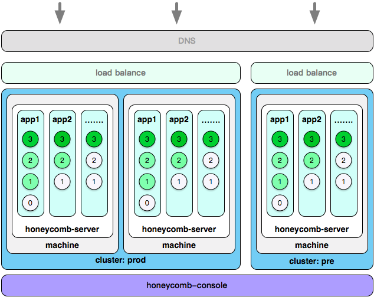
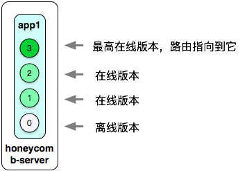
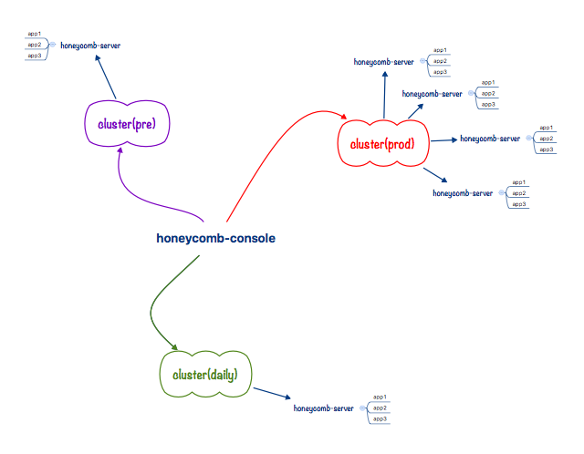

# Honeycomb简介

Honeycomb是基于Node.js实现的微应用体系。通过它可以方便将业务根据路由拆分成细力度的小app来开发、并在发布时组装在一起，解耦的同时不带来开发运维麻烦，让业务迭代更敏捷，以此来加速产品迭代。

在web应用功能越来越多、体积越来越庞大的情况下，后端服务已经走向分布式、微服务化，通过总线注册、消费服务，从而实现业务单元化治理。

同样前端UI层也需要类似的总线来实现服务的注册、消费，而前端服务的访问地址即类似后端服务总线的存在。一个域名入口下，产品开发者通过路径来划分功能块、每个功能对应到小app。

Honeycomb体系即是要解决这一需求：拆分微应用开发，发布自动注册路由，在实现业务功能模块解耦的同时不增加服务的运维管理成本，同时server具备高可用性保障、集成基础运维工具，大大降低UI层应用研发难度。

### honeycomb主要有以下部分组成： 

* honeycomb-server 服务，一台机器安装一个服务
* honeycomb-cluster 集群，多台机器组成一个集群
* honeycomb-console 控制台，一个控制台可以管理多个集群
* honeycomb-cli 命令行工具，开发辅助用
* hc-bee 开发框架，运行在server上的app需要基于框架开发
* honeycomb app 即实际业务的小应用

其结构关系如下：

* 一台机器(or docker container)安装一个honeycomb-server
* 一个或多台机器组成一个honeycomb-cluster集群
* 一个或多个集群可由同一个honeycomb-console控制
* 基于hc-bee框架开发的小app，并通过hoenycomb-console发布到集群中，应用即完成发布

*** 参考下图来理解Honeycomb体系：***

* console管理了两个集群：预发pre{1机}、生产pro{2机互备} (可管理更多集群)
* 每个机器需要且只要安装一个server，来提供应用管理守护能力。
* 每个server可以发布多个app（能发几多个视机器性能而定）
* 每个app可以有多版本（在线/关停都可能有多个，但路由只能访问到最高在线版:墨绿色）
* 集群外部访问需要额外辅助（load balance、dns解析目前都不在honeycomb管辖中），内部的vhost、路由解析则由server根据app注册信息来下发流量。

*** 再仔细展开一下server中app多版本的逻辑： ***

* app1在server上一共有0-3 4个版本的代码
* 3个版本在线（v1, v2, v3）
* 请求的路由都会落到v3版本（server的约定：在线的最高版本接收请求）

*** 常见的研发场景中，通常会有三个环境：daily/pre/prod 三个环境*** 

### honeycomb-console提供UI界面管理，具备如下功能：

	* 支持app：publish、start、stop、reload、delete管理
	* 支持同域名下路径级别路由（不同路径访问到不同的app）
	* 支持app的配置管理
	* 支持简单的性能监控
	* 支持在线查看app日志
	* 支持多集群管理
	* 支持集成Aliode
	* 支持主流框架的集成

### 应用开发

Honeycomb体系中默认提供的hc-bee框架可以稳定的运行在server上，但server并不限制app的框架，相反的定制一个运行在honeycomb-server上的框架并不复杂，详细可参考App框架定制章节。

考虑到现实情况每个团队都会有自己的一套框架，官方会提供当前热门框架的定制样例（express/koa/eggjs等）。
