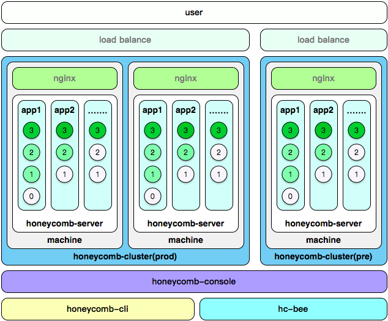

# Honeycomb简介

Honeycomb是基于Node.js实现的微应用的托管服务。通过它可以方便的拆分业务、混合部署，改进研发结构，提高研发效率。

看一个产品例子:

honeycomb主要有几大部分组成： 

* honeycomb-server 服务，一台机器安装一个服务
* honeycomb-cluster 集群，多台机器组成一个集群
* honeycomb-console 控制台，一个控制台管理多个集群
* honeycomb-cli 开发辅助工具
* hc-bee 开发框架，运行在server上的app需要基于框架开发
* honeycomb app 即实际业务的应用

其结构关系如下：
* 一台机器(or docker)安装一个honeycomb-server
* 多台机器组成一个honeycomb-cluster集群
* 多个集群由同一个honeycomb-console控制
* 基于hc-bee框架，使用honeycomb-cli开发app，并通过hoenycomb-console发布到集群

它提供UI界面管理，具备如下功能特性：

	* 支持app：publish、start、stop、reload、delete管理
	* 支持同域名下路径级别路由，可以灵活拆分小应用
	* 支持app的配置管理
	* 支持简单的性能监控
	* 支持在线查看app日志
	* 支持多集群管理
	* 支持集成Aliode
	* 支持主流框架的集成

在web应用功能越来越多、体态越来越庞大的情况下，系统架构上必须做出变化。我们在面对复杂代码逻辑的时候选择封装、对象抽取、结构分层，同样我们在面对复杂业务的时候，也可以选择封装、单元化，微服务的概念便是在这种场景下兴起。

Honeycomb就是面向微服务场景，支持无论单台机器还是多集群，支持应用的上下线管理， 具备高可用性，灵活敏捷。

***典型的应用场景*** 通常的开发情况下，daily/pre/prod 三个环境，honeycomb管理下的结构如下：

